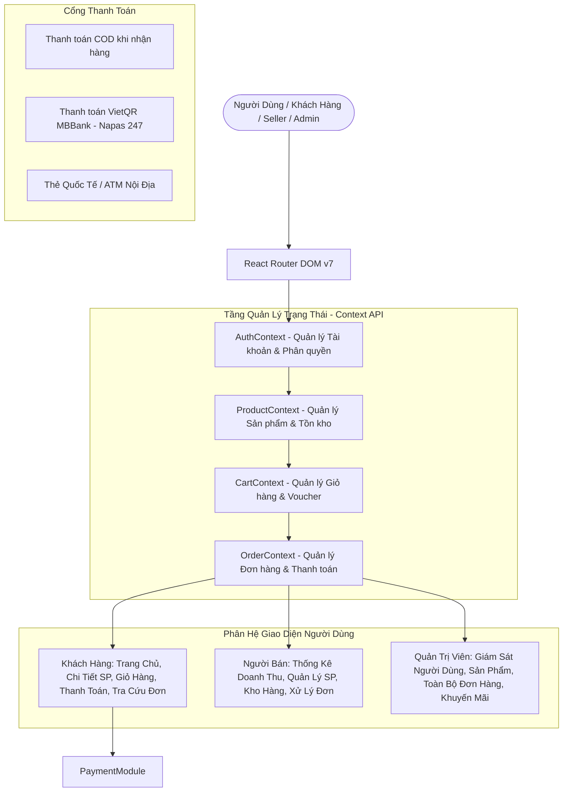
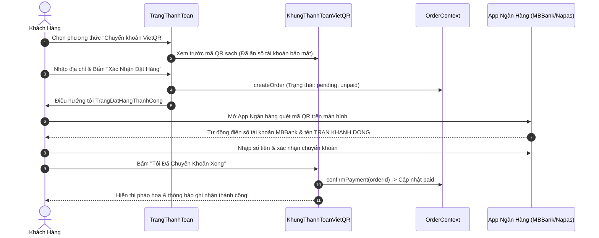

# 🛒 GiaDụngSmart - Website Thương Mại Điện Tử Đồ Gia Dụng Thông Minh

> Dự án website bán hàng đồ gia dụng chính hãng được xây dựng bằng **React 19**, **Vite**, **Tailwind CSS 4**, tích hợp đa vai trò (Khách hàng, Người bán, Quản trị viên) và phương thức thanh toán **Mã QR (VietQR MBBank)** bảo mật.

---

## 📐 Kiến Trúc Hệ Thống (System Architecture)



---

## 💳 Quy Trình Thanh Toán Bằng Mã QR (VietQR MBBank)



---

## 🗂 Cấu Trúc Thư Mục Dự Án (Project Structure)

```
24ct1.trankhanhdong/
├── public/                       # Tài nguyên tĩnh
│   ├── qr-card-clean.png         # Ảnh thẻ mã QR MBBank (bảo mật số tài khoản)
│   ├── qr-payment-clean.png      # Ảnh poster mã QR đầy đủ
│   └── favicon.svg               # Logo trang web
├── src/                          # Mã nguồn ứng dụng
│   ├── assets/                   # Hình ảnh minh họa & icon
│   ├── components/               # Các component giao diện
│   │   ├── dung-chung/           # Thành phần chung (Header, Footer, Toast, Navbar)
│   │   ├── khach-hang/           # Component khách hàng (KhungThanhToanVietQR, Thẻ SP)
│   │   ├── nguoi-ban/            # Layout & thanh điều hướng người bán (Seller)
│   │   └── quan-tri/             # Layout & sidebar quản trị viên (Admin)
│   ├── context/                  # Quản lý trạng thái toàn cục (Context API)
│   │   ├── AuthContext.jsx       # Đăng nhập, đăng ký, chuyển đổi vai trò
│   │   ├── CartContext.jsx       # Thêm/bớt giỏ hàng, áp mã giảm giá
│   │   ├── OrderContext.jsx      # Tạo đơn, duyệt đơn, xác nhận VietQR, bảo hành
│   │   └── ProductContext.jsx    # Tồn kho, phân loại danh mục, tìm kiếm
│   ├── data/
│   │   └── mockData.js           # Dữ liệu mẫu (Sản phẩm gia dụng, đơn hàng, user)
│   ├── pages/                    # Các trang hiển thị chính
│   │   ├── khach-hang/           # TrangChu, TrangSanPham, TrangThanhToan, TrangDatHangThanhCong...
│   │   ├── nguoi-ban/            # TongQuanNguoiBan, SanPhamNguoiBan, DonHangNguoiBan...
│   │   ├── quan-tri/             # TongQuanQuanTri, QuanLyNguoiDung, QuanLyDonHang...
│   │   └── xac-thuc/             # TrangDangNhap, TrangDangKy
│   ├── routes/
│   │   └── AppRoutes.jsx         # Khai báo tuyến đường & Route bảo vệ vai trò
│   ├── App.jsx                   # Component gốc gắn các Provider
│   ├── index.css                 # Phong cách Tailwind CSS 4
│   └── main.jsx                  # Điểm khởi chạy ứng dụng (Entry point)
├── server/                       # Backend Node.js / Express (Tùy chọn)
│   ├── src/                      # API router, controllers
│   ├── database.sql              # Kịch bản cơ sở dữ liệu SQL
│   └── package.json              # Cấu hình backend server
├── index.html                    # Tệp HTML mẫu Vite
├── package.json                  # Cấu hình thư viện và scripts frontend
├── vite.config.js                # Cấu hình Vite React & Tailwind
├── netlify.toml                  # Cấu hình build & redirect cho Netlify/Vercel
└── README.md                     # Tài liệu kiến trúc dự án
```

---

## ⚡ Công Nghệ Sử Dụng (Tech Stack)

- **Frontend Core:** [React 19](https://react.dev/), [Vite 8](https://vitejs.dev/)
- **Routing:** [React Router DOM v7](https://reactrouter.com/)
- **Styling:** [Tailwind CSS v4](https://tailwindcss.com/)
- **Icons:** [Lucide React](https://lucide.dev/)
- **Effects:** [Canvas Confetti](https://www.npmjs.com/package/canvas-confetti)
- **Payment Integration:** VietQR Napas 247 (MBBank)
- **Backend (Optional):** Node.js, Express, MySQL/PostgreSQL

---

## 🚀 Hướng Dẫn Cài Đặt & Chạy Cục Bộ

1. **Cài đặt dependencies:**
   ```bash
   npm install
   ```

2. **Chạy máy chủ phát triển:**
   ```bash
   npm run dev
   ```

3. **Kiểm tra và đóng gói sản phẩm:**
   ```bash
   npm run build
   npm run preview
   ```
