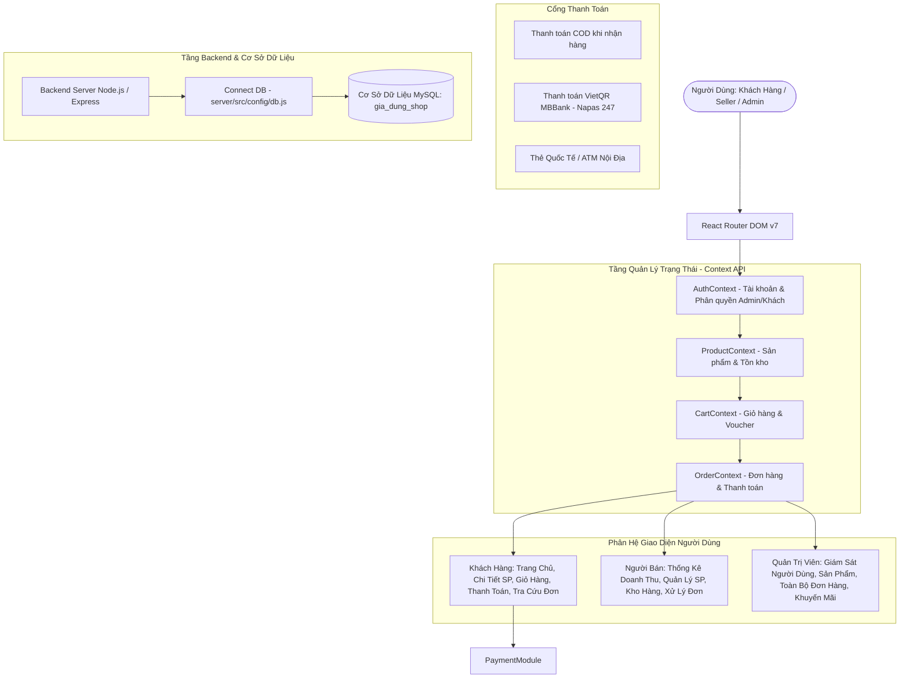
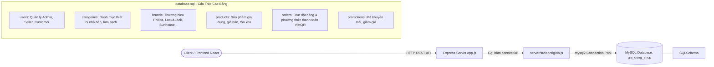
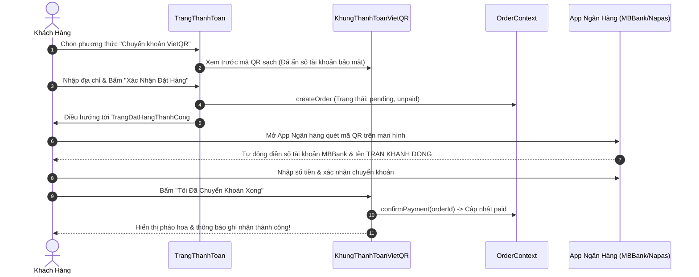

# 🛒 GiaDụngSmart - Website Thương Mại Điện Tử Đồ Gia Dụng Thông Minh

> Dự án website bán hàng đồ gia dụng chính hãng được xây dựng bằng **React 19**, **Vite**, **Tailwind CSS 4**, tích hợp đa vai trò (Khách hàng, Người bán, Quản trị viên), phương thức thanh toán **Mã QR (VietQR MBBank)** bảo mật và Backend **Node.js/Express kết nối Cơ sở dữ liệu MySQL**.

---

## 📐 Kiến Trúc Hệ Thống (System Architecture)



---

## 🗄️ Cấu Hình & Kết Nối Cơ Sở Dữ Liệu (Database Connection - MySQL)

Hệ thống được cấu hình kết nối trực tiếp tới cơ sở dữ liệu quan hệ **MySQL** qua Connection Pool trong tệp `server/src/config/db.js`:



### 1. Tệp Kịch Bản Cơ Sở Dữ Liệu (SQL Schema)
- **Vị trí file:** [`server/database.sql`](server/database.sql)
- **Tên CSDL:** `gia_dung_shop` (Mã hóa `utf8mb4_unicode_ci`)
- **Các bảng chính:**
  - `users`: Lưu trữ thông tin tài khoản, phân quyền `admin`, `seller`, `customer`.
  - `products`: Quản lý danh sách thiết bị gia dụng, mô tả, hình ảnh và tồn kho.
  - `orders` & `order_items`: Lưu đơn hàng và trạng thái thanh toán (COD / BANK_QR).
  - `categories` & `brands`: Phân loại danh mục và nhãn hàng chính hãng.
  - `promotions`: Quản lý voucher khuyến mãi.

### 2. Tệp Cấu Hình Kết Nối (Connect DB Module)
- **Vị trí file:** [`server/src/config/db.js`](server/src/config/db.js)
- **Công nghệ kết nối:** Thư viện `mysql2/promise` với cơ chế **Connection Pool** (10 kết nối đồng thời), tự động kiểm tra và phục hồi kết nối.
- **Hàm kết nối chính:** `connectDB()` được tự động thực thi khi khởi chạy máy chủ tại [`server/src/app.js`](server/src/app.js).

### 3. Cấu Hình Biến Môi Trường (.env)
Tệp [`server/.env`](server/.env) và mẫu [`server/.env.example`](server/.env.example):
```env
PORT=3000
NODE_ENV=development

# Thông số kết nối Database MySQL (XAMPP / WampServer)
DB_HOST=localhost
DB_PORT=3306
DB_USER=root
DB_PASSWORD=
DB_NAME=giadungsmart
```

### 4. API Kiểm Tra Trạng Thái Kết Nối CSDL (Database Healthcheck)
- **Endpoint:** `GET http://localhost:3000/api/v1/db-status`
- **Kết quả trả về:**
```json
{
  "status": "connected",
  "database": "gia_dung_shop",
  "host": "localhost:3306",
  "message": "Đã kết nối thành công tới Database MySQL gia_dung_shop",
  "schema": "gia_dung_shop (Tables: users, products, orders, categories, brands, promotions)"
}
```

---

## 💳 Quy Trình Thanh Toán Bằng Mã QR (VietQR MBBank)



---

## 🗂 Cấu Trúc Thư Mục Dự Án (Project Structure)

```
24ct1.trankhanhdong/
├── public/                       # Tài nguyên tĩnh
│   ├── qr-card-clean.png         # Ảnh thẻ mã QR MBBank (bảo mật số tài khoản)
│   ├── qr-payment-clean.png      # Ảnh poster mã QR đầy đủ
│   └── favicon.svg               # Logo trang web
├── src/                          # Mã nguồn Frontend React
│   ├── assets/                   # Hình ảnh minh họa & icon
│   ├── components/               # Các component giao diện
│   │   ├── dung-chung/           # Thành phần chung (Header, Footer, Toast, Navbar)
│   │   ├── khach-hang/           # Component khách hàng (KhungThanhToanVietQR, Thẻ SP)
│   │   ├── nguoi-ban/            # Layout & thanh điều hướng người bán (Seller)
│   │   └── quan-tri/             # Layout & sidebar quản trị viên (Admin)
│   ├── context/                  # Quản lý trạng thái toàn cục (Context API)
│   │   ├── AuthContext.jsx       # Tài khoản Admin luôn có sẵn, phân quyền khách hàng
│   │   ├── CartContext.jsx       # Thêm/bớt giỏ hàng, áp mã giảm giá
│   │   ├── OrderContext.jsx      # Tạo đơn, duyệt đơn, xác nhận VietQR, bảo hành
│   │   └── ProductContext.jsx    # Tồn kho, phân loại danh mục, tìm kiếm
│   ├── data/
│   │   └── mockData.js           # Dữ liệu mẫu (Sản phẩm gia dụng, đơn hàng, user)
│   ├── pages/                    # Các trang hiển thị chính
│   │   ├── khach-hang/           # TrangChu, TrangSanPham, TrangThanhToan, TrangDatHangThanhCong...
│   │   ├── nguoi-ban/            # TongQuanNguoiBan, SanPhamNguoiBan, DonHangNguoiBan...
│   │   ├── quan-tri/             # TongQuanQuanTri, QuanLyNguoiDung, QuanLyDonHang...
│   │   └── xac-thuc/             # TrangDangNhap, TrangDangKy, TrangTuChoiTruyCap
│   ├── routes/
│   │   └── AppRoutes.jsx         # Khai báo tuyến đường & Route bảo vệ vai trò (ProtectedRoute)
│   ├── App.jsx                   # Component gốc gắn các Provider
│   ├── index.css                 # Phong cách Tailwind CSS 4
│   └── main.jsx                  # Điểm khởi chạy ứng dụng (Entry point)
├── server/                       # Backend Node.js / Express & Kết nối Database
│   ├── src/
│   │   ├── config/
│   │   │   └── db.js             # MODULE KẾT NỐI DATABASE MYSQL (connectDB)
│   │   ├── controllers/          # Controllers xử lý yêu cầu
│   │   ├── routes/               # Tuyến đường API
│   │   └── app.js                # Khởi động server Express & kết nối MySQL
│   ├── database.sql              # Kịch bản tạo Database gia_dung_shop & các bảng
│   ├── .env.example              # Mẫu cấu hình biến môi trường Database
│   └── package.json              # Cấu hình Express, mysql2, cors, dotenv
├── index.html                    # Tệp HTML mẫu Vite
├── package.json                  # Cấu hình thư viện và scripts frontend
├── vite.config.js                # Cấu hình Vite React & Tailwind
├── netlify.toml                  # Cấu hình build & redirect cho Netlify/Vercel
└── README.md                     # Tài liệu kiến trúc dự án & Database
```

---

## ⚡ Công Nghệ Sử Dụng (Tech Stack)

- **Frontend Core:** [React 19](https://react.dev/), [Vite 8](https://vitejs.dev/)
- **Routing:** [React Router DOM v7](https://reactrouter.com/)
- **Styling:** [Tailwind CSS v4](https://tailwindcss.com/)
- **Icons:** [Lucide React](https://lucide.dev/)
- **Effects:** [Canvas Confetti](https://www.npmjs.com/package/canvas-confetti)
- **Payment Integration:** VietQR Napas 247 (MBBank)
- **Backend & Database:** Node.js, Express, MySQL (`mysql2/promise` Connection Pool)

---

## 🚀 Hướng Dẫn Cài Đặt & Chạy Cục Bộ

1. **Khởi động Cơ sở dữ liệu:**
   - Mở **XAMPP** và bật dịch vụ **MySQL**.
   - Truy cập `http://localhost/phpmyadmin` và import tệp [`server/database.sql`](server/database.sql).

2. **Chạy Backend Server:**
   ```bash
   cd server
   npm install
   npm start
   ```
   *Kiểm tra kết nối CSDL tại: `http://localhost:3000/api/v1/db-status`*

3. **Chạy Frontend React:**
   ```bash
   npm install
   npm run dev
   ```
